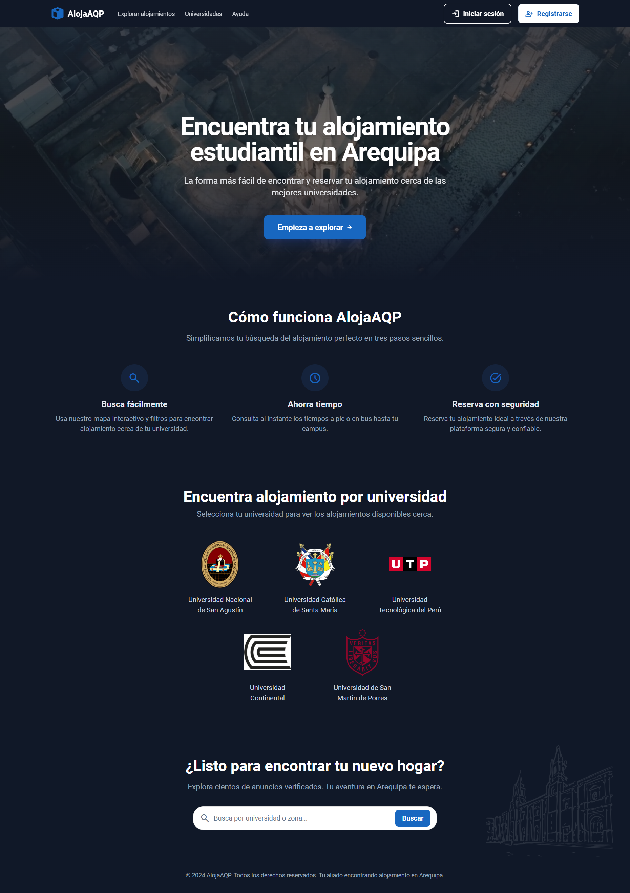
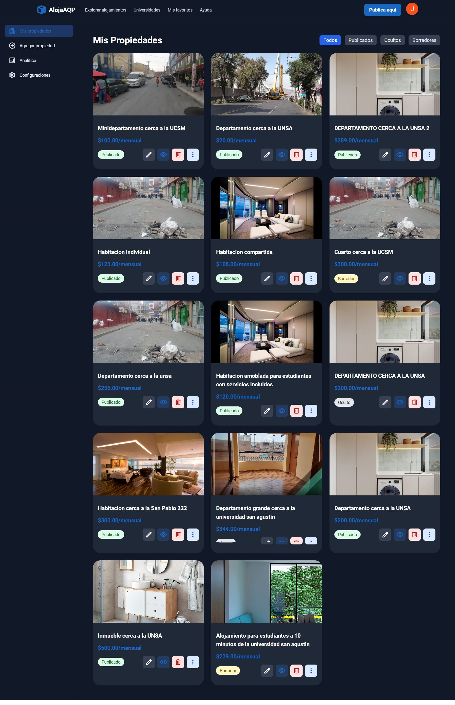
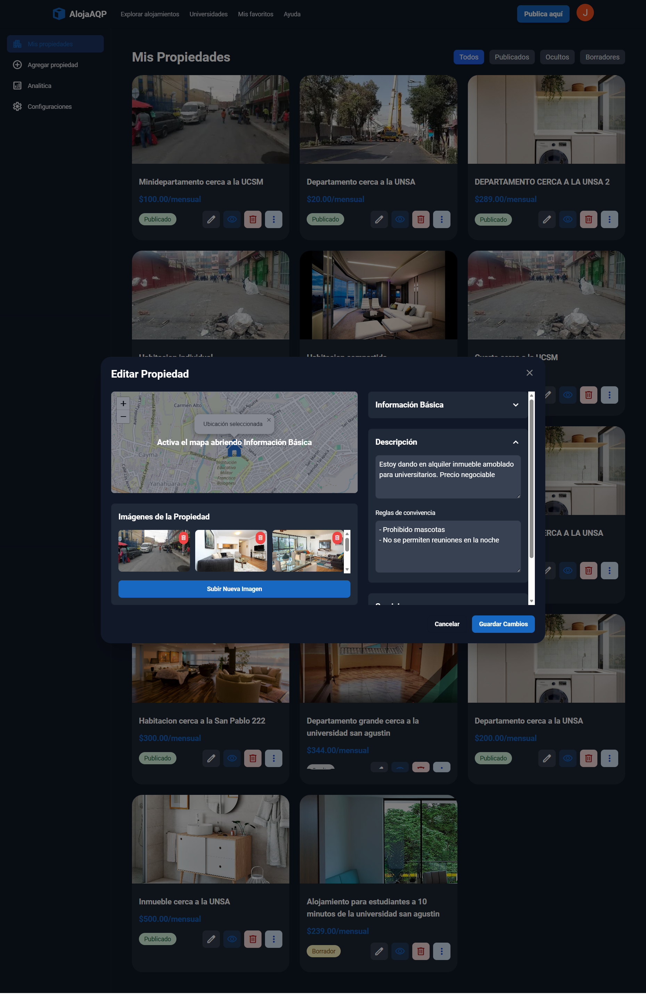
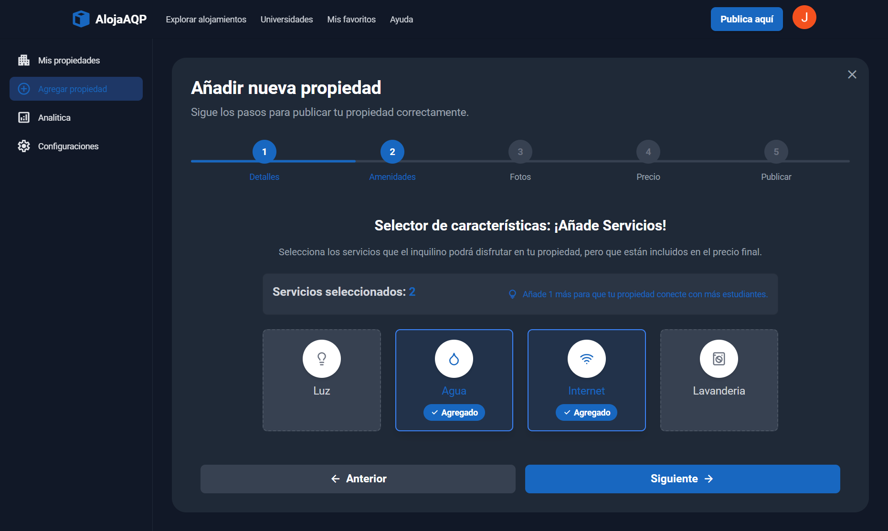
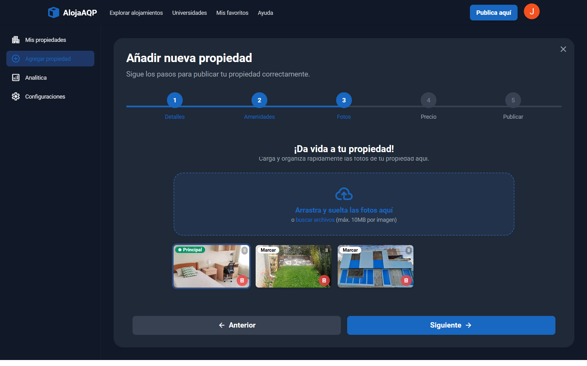
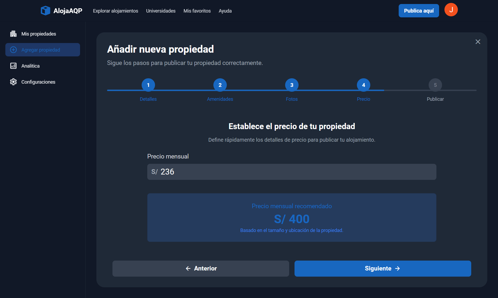
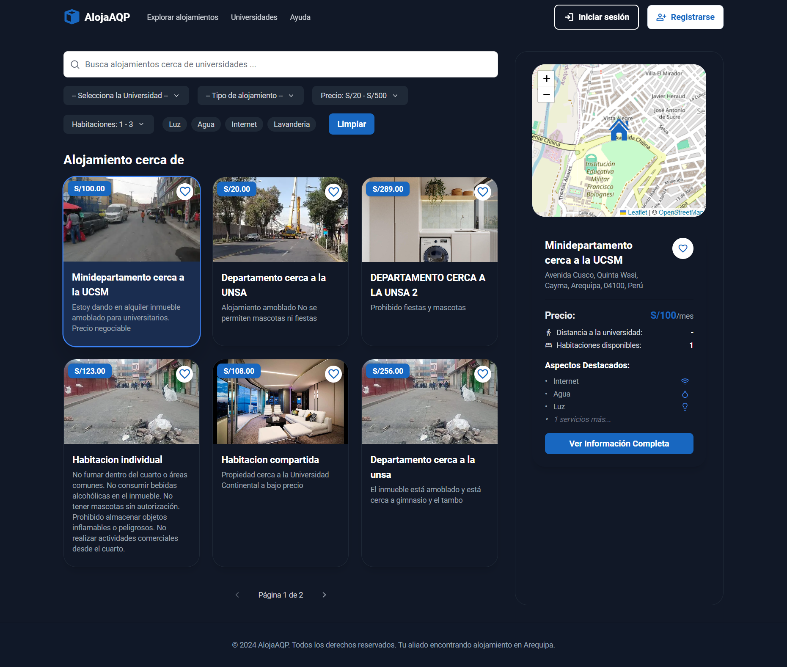
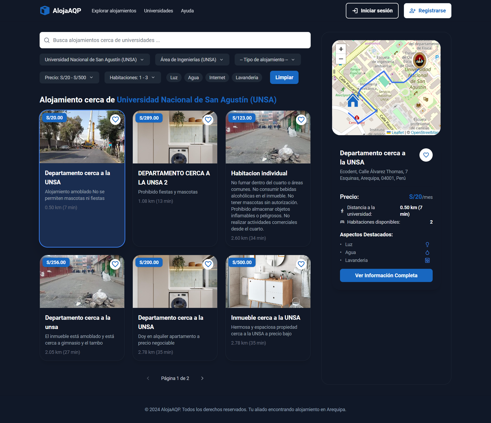
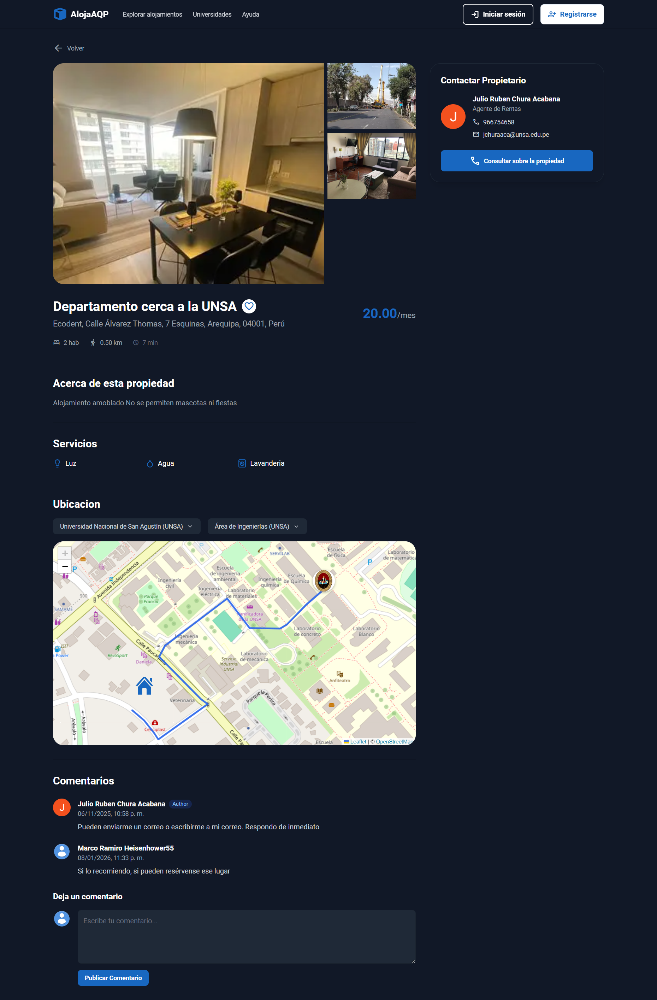

# 🏡 Datos Iniciales para la Base de Datos

## 📸 Screenshots de la Aplicación

<!-- Galería principal: 3 imágenes grandes -->

<!-- Galería secundaria: miniaturas clickeables -->

	
Ver más screenshots

	

		
		
		
		
		
		
		
	

---

## 🛏️ Tabla: `accommodation_types`

| Nombre | Descripción |
|---------|--------------|
| **Room** | Un espacio individual dentro de una vivienda o edificio, generalmente con acceso compartido a cocina o baño. Ideal para viajeros solitarios o estancias cortas con un presupuesto más económico. |
| **Condominio** | Una unidad dentro de un edificio o complejo residencial compartido que ofrece servicios comunes, como piscina, gimnasio o seguridad. Combina la independencia de un departamento con las ventajas de instalaciones compartidas. |
| **House** | Una vivienda completa e independiente que ofrece mayor espacio, privacidad y comodidades como jardín, garaje o terraza. Perfecta para familias o grupos grandes que desean sentirse como en casa. |
| **Apartment** | Un espacio privado dentro de un edificio o complejo residencial que cuenta con áreas independientes como sala, cocina, baño y uno o más dormitorios. Ideal para estancias largas o grupos pequeños que buscan comodidad y privacidad. |

---

## 🧩 Tabla: `predefined_services`

| Name |Icon class
|-----------|-----------|
| Swimming Pool |pool|
| Parking Available |local_parking|
| Pet-Friendly |pets|
| Balcony/Patio |park|
| Air Conditioning |ac_unit|
| In-unit Laundry |local_laundry_service|
| Wi-Fi Included |wifi|
| Full Kitchen |kitchen|

---

## 🎓 Tabla: `university_campuses`

| Nombre | Universidad | Dirección | Latitud | Longitud |
|---------|--------------|------------|----------|-----------|
| Área Sociales - UNSA | UNSA | Calle San Agustin 107, Arequipa 04002 | -16.405969 | -71.520543 |
| Área Biomédicas - UNSA | UNSA | Av. Virgen del Pilar s/n, Área de Biomédicas de la UNSA | -16.41248 | -71.534752 |
| Área de Ingenierías - UNSA | UNSA | HFWF+29F, Arequipa 04001 | -16.404684 | -71.524577 |
